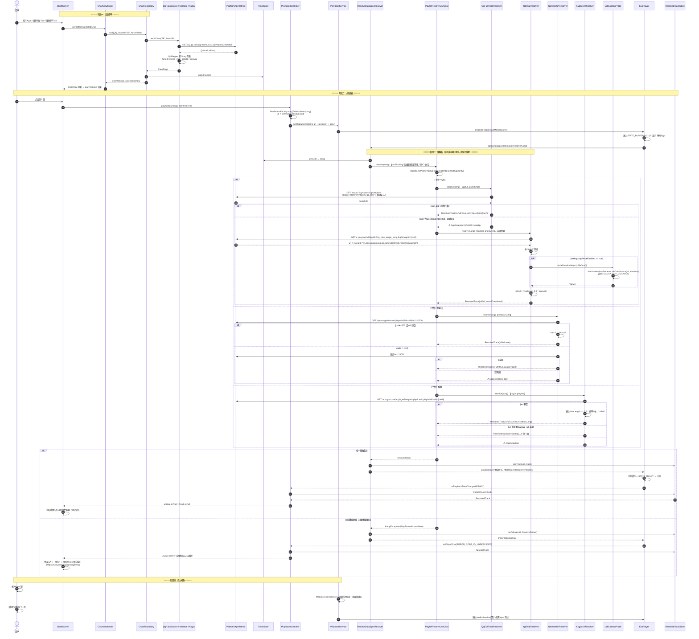
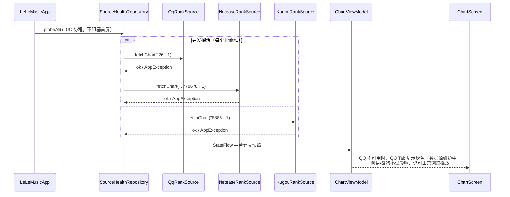
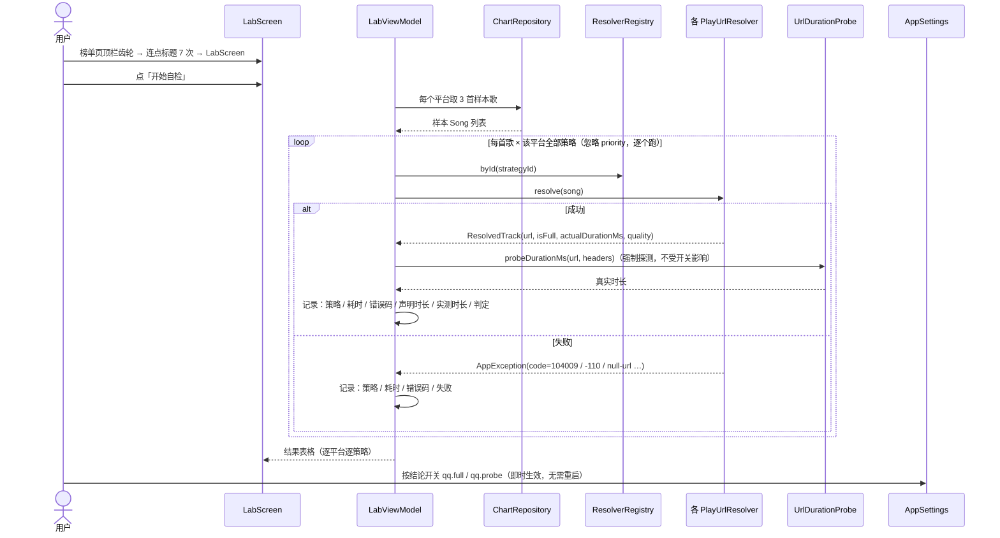
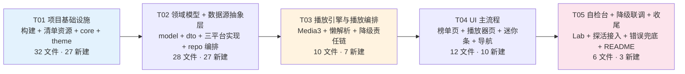

# LeLeMusic 系统架构设计 & 任务分解

> 项目代号：LeLeMusic
> 文档版本：v1.0
> 作者：高见远（架构师）
> 上游输入：`docs/PRD.md`（v1.0，许清楚）、`docs/api-feasibility.md`（v1.0，高见远）
> 状态：**待工程师执行**
> 目标读者：工程师（无本地编译环境，本文件即施工图）

---

## 0. 开篇：给工程师的三句话

1. **本文档所有第三方依赖版本已写死**，请**逐字照抄** `gradle/libs.versions.toml`，不要改任何一个数字。版本组合已在 §1.3 论证兼容性。
2. **不引入 Hilt、不引入 Room、不引入 KSP**——这是为了让本项目在"无法本地编译验证"的前提下最大化一次编译通过的概率。依赖注入用 `AppGraph`（手动 ServiceLocator），持久化用 `SharedPreferences`。理由见 §1.4。
3. **QQ 音乐全曲是一个"未决问题"，不是一个"阻塞项"**。它被封装成 `QqFullTrackResolver`，成功与否都不影响其他两平台和整体架构。你的任务是把**三态降级链**和**自检台**做扎实，让用户在真机上跑一次就知道结论。

---

## 目录

- [1. 实现方案与框架选型](#1-实现方案与框架选型)
- [2. 完整文件清单](#2-完整文件清单)
- [3. 数据结构与接口（类图）](#3-数据结构与接口类图)
- [4. 程序调用流程（时序图）](#4-程序调用流程时序图)
- [5. 依赖包清单与版本目录](#5-依赖包清单与版本目录)
- [6. 有序任务列表](#6-有序任务列表)
- [7. 共享知识 / 跨文件约定](#7-共享知识--跨文件约定)
- [8. 待明确事项与风险](#8-待明确事项与风险)
- [附录 A：关键代码片段](#附录-a关键代码片段)
- [附录 B：编译前自检清单](#附录-b编译前自检清单)

---

## 1. 实现方案与框架选型

### 1.1 技术难点分析

| # | 难点 | 来自 | 本设计的应对 |
|---|------|------|-------------|
| D1 | 三平台数据结构差异极大：QQ 用 `mid` + `media_mid` **双 ID**，网易用数字 `id`，酷狗用 `hash` | 调研 D3-1 | 统一领域模型 `Song` + `extras: Map<String,String>` 承载平台私有解析上下文；每平台一个 Mapper |
| D2 | 播放直链**必须两阶段取、且短时效**（网易 20 分钟过期） | 调研 B2.3 / D3-3 | `MediaSource.Factory` 层**懒解析**（`ResolvingDataSource`），每次真正读流时才换 URL；**直链永不落盘** |
| D3 | **QQ 全曲直链未打通**（vkey 双方案实测失败） | 调研 B1 / D4 | `PlayUrlResolver` 接口 + 责任链；QQ 实现「全曲」「试听」两个策略，配置开关 + 运行时自动降级 |
| D4 | C100 地址到底是不是全曲，不能靠猜 | 调研 B1.3 / D4-2 | `UrlDurationProbe` 用 `MediaMetadataRetriever` 读真实时长，与 `interval` 对比，**≥90% 判全曲** |
| D5 | 失败与降级必须是一等公民 | PRD 第六章 | 领域模型内置 `PlayableStatus` 三态 + 责任链兜底 + 可操作错误态 |
| D6 | 网易云直链是 `http://` 明文，Android 9+ 禁 cleartext | 调研 C4-1 | 双保险：Mapper/Resolver 强制改写 `https://` + `network_security_config.xml` 对 `music.126.net` 开白 |
| D7 | 接口随时失效，不能白屏 | 调研 D3-5 | 启动轻量探活 `SourceHealthRepository` → 平台 Tab 显示「数据源维护中」，故障隔离 |
| D8 | 后台播放 + 通知栏 + 音频焦点 + 耳机拔出 + 来电让出 | PRD REQ-P1-10（本轮提为 **P0**） | Media3 `MediaSessionService` 自动前台服务与通知；`AudioAttributes` 自动音频焦点；显式 `BecomingNoisyReceiver` |
| D9 | **无本地编译环境** | 环境约束 | 砍掉 Hilt/Room/KSP；版本写死；`libs.versions.toml` 完整给出；附录 B 提供编译前自检清单 |

### 1.2 架构模式

**MVVM + Repository + 可插拔数据源层**（单向数据流）

```
┌──────────────────────────────────────────────────────────────┐
│  UI 层 (Jetpack Compose)                                      │
│  Screen ← observe StateFlow<UiState> ── ViewModel             │
│     └── emit 用户意图 (onClick…)                              │
├──────────────────────────────────────────────────────────────┤
│  ViewModel 层                                                 │
│  ChartViewModel / PlayerViewModel / LabViewModel              │
│     └── viewModelScope.launch(Dispatchers.IO)                 │
├──────────────────────────────────────────────────────────────┤
│  Repository / UseCase 层                                      │
│  ChartRepository  PlayUrlResolveUseCase  SourceHealthRepo     │
│     └── 编排 / 降级 / 超时 / 故障隔离                         │
├──────────────────────────────────────────────────────────────┤
│  数据源抽象层 ★可插拔★                                        │
│  interface RankSource     interface PlayUrlResolver           │
│     ├── QqRankSource          ├── QqFullTrackResolver (P10)   │
│     ├── NeteaseRankSource     ├── QqTrialResolver     (P20)   │
│     └── KugouRankSource       ├── NeteaseUrlResolver  (P10)   │
│                               └── KugouUrlResolver    (P10)   │
├──────────────────────────────────────────────────────────────┤
│  基础设施层                                                    │
│  OkHttp(全局 UA/Referer 拦截器) + Retrofit + Gson             │
│  Media3 播放引擎  SharedPreferences  AppGraph(手工 DI)        │
└──────────────────────────────────────────────────────────────┘
```

**抽象只做在数据源层**——这是刚需（三平台 + 未来可能加中转服务）。UI / ViewModel / Repository 不做多余抽象，直接实现，避免过度设计。

### 1.3 版本组合与兼容性依据（**不要改动**）

| 组件 | 版本 | 说明 |
|------|------|------|
| JDK | **17** | AGP 8.x 硬性要求 |
| Gradle Wrapper | **8.2** (`gradle-8.2-bin.zip`) | AGP 8.1 要求 Gradle ≥ 8.0；8.2 为该线稳定版 |
| Android Gradle Plugin | **8.1.4** | 与 Gradle 8.2 / JDK 17 匹配 |
| Kotlin | **1.9.22** | — |
| Compose Compiler | **1.5.8** | **Google 官方 Compose–Kotlin 兼容对照表中，1.5.8 ↔ Kotlin 1.9.22 是明确对应的一组** |
| Compose BOM | **2023.10.01** | 锁定 runtime/ui/foundation 1.5.4、material3 1.1.2，与 Compiler 1.5.8 同属 1.5 线，**不同线混用才会出问题** |
| compileSdk / targetSdk | **34** | Android 14；`FOREGROUND_SERVICE_MEDIA_PLAYBACK` 在 targetSdk 34 下为**强制** |
| minSdk | **26** | Android 8.0，覆盖 ~98% 设备 |
| Media3 | **1.2.1** | exoplayer / session；与 compileSdk 34、Kotlin 1.9 无冲突 |
| OkHttp | **4.12.0** | Kotlin 1.9 兼容 |
| Retrofit | **2.9.0** | 与 OkHttp 4.12 兼容 |
| Gson | **2.10.1** | — |
| Coil | **2.5.0** | ⚠️ **不能用 Coil 3.x**，3.x 要求 Kotlin 2.0，会直接编不过 |
| kotlinx-coroutines | **1.7.3** | Kotlin 1.9 兼容 |
| Navigation Compose | **2.7.7** | 与 Compose 1.5 线匹配 |
| Lifecycle | **2.7.0** | — |
| Activity Compose | **1.8.2** | — |
| Core KTX | **1.12.0** | — |

> **兼容性三条铁律**
> 1. **Compose Compiler 版本由 Kotlin 版本决定**（不是由 BOM 决定）：Kotlin 1.9.22 → Compiler 1.5.8。
> 2. **Compose 库版本由 BOM 决定**，BOM 覆盖的库**不要再写 version**（写了会以你写的为准，容易错线）。
> 3. **BOM 不在 `composeOptions` 里配置**，`composeOptions.kotlinCompilerExtensionVersion` 必须显式写 `"1.5.8"`。

### 1.4 关于 Hilt 的取舍：**不引入，改用手工 DI（`AppGraph`）**

| 维度 | Hilt (`2.48`) | 手工 DI（`AppGraph` 单例） |
|------|---------------|---------------------------|
| 额外 Gradle 插件 | 需要 `com.google.dagger.hilt.android` 插件 | **无** |
| 额外注解处理器 | **需要 KSP**（`ksp` 插件 + `hilt-compiler`），KSP 版本必须与 Kotlin 1.9.22 精确匹配（1.9.22-1.0.17），配错一个字符就编译失败 | **无** |
| `MediaSessionService` 注入 | 已知坑：`@AndroidEntryPoint` 与 Media3 前台服务的生命周期时序有历史 issue，需要额外处理 `EntryPoint` | 直接 `AppGraph.xxx`，零风险 |
| 代码量 | 少一点 | 多约 40 行（`AppGraph.kt` 一个文件） |
| 可测试性 | 好 | 够用（MVP 不写单测） |

**结论：不引入 Hilt。** 本项目只有 ~65 个文件、一个 Activity、一个 Service、3 个 ViewModel，手工 DI 的边际成本远低于"KSP 版本配错导致整轮返工"的风险。同理：

- **不引入 Room**（P1 才需要本地缓存，MVP 用 `SharedPreferences` 存播放模式与开关；Room 需要 KSP，是本环境第二大编译风险源）。
- **不引入 KSP / kapt**（因此不需要 `ksp` 插件，Gradle 构建脚本显著变简单）。
- **不引入 Accompanist**（权限、Insets、System UI 全部用 `androidx.activity` / `androidx.core` 官方 API 或干脆不做）。
- **不引入 DataStore**（`SharedPreferences` 足够，少一个协程相关的依赖）。

---

## 2. 完整文件清单

> **全项目共 79 个文件**，编号 1–79 连续，下表每种文件只列一次（后续任务章节中的"修改"不重复计数）。
> 根路径 `D:\tools\lelemusic\`；表中 `.../` 代表 `app/src/main/kotlin/com/lelemusic/`。
> 分布：构建配置 7 · app 模块 2 · 清单与资源 10 · core 8 · model 5 · data 抽象 4 · 远程/DTO 4 · 平台实现 10 · repo 3 · player 9 · ui 16 · 其他 1

### 2.1 构建与配置（T01，7 个文件）

| # | 路径 | 说明 |
|---|------|------|
| 1 | `settings.gradle.kts` | 仓库源 + `include(":app")` |
| 2 | `build.gradle.kts`（根） | 仅声明插件，`apply false` |
| 3 | `gradle/libs.versions.toml` | **版本目录，完整内容见 §5.2，逐字照抄** |
| 4 | `gradle.properties` | JVM 参数、`useAndroidX` |
| 5 | `gradle/wrapper/gradle-wrapper.properties` | `gradle-8.2-bin.zip` |
| 6 | `.gitignore` | `*.iml` / `.gradle/` / `local.properties` / `/build` |
| 7 | `local.properties.example` | 示例（`sdk.dir=...`），工程师需复制为 `local.properties` 并改为本机 SDK 路径 |

### 2.2 App 模块构建（T01，2 个文件）

| # | 路径 | 说明 |
|---|------|------|
| 8 | `app/build.gradle.kts` | 完整内容见 §附录 A.1 |
| 9 | `app/proguard-rules.pro` | MVP 关闭混淆，保留默认内容即可 |

### 2.3 AndroidManifest 与资源（T01，10 个文件）

| # | 路径 | 说明 |
|---|------|------|
| 10 | `app/src/main/AndroidManifest.xml` | **关键**：权限 + Service + Receiver，见 §附录 A.2 |
| 11 | `app/src/main/res/xml/network_security_config.xml` | `music.126.net` 等域名开 cleartext |
| 12 | `app/src/main/res/values/strings.xml` | `app_name`、错误文案、平台名 |
| 13 | `app/src/main/res/values/colors.xml` | 仅 `ic_launcher_background` 色值 |
| 14 | `app/src/main/res/values/themes.xml` | parent `android:Theme.Material.Light.NoActionBar` |
| 15 | `app/src/main/res/values-night/themes.xml` | parent `android:Theme.Material.NoActionBar`（深色） |
| 16 | `app/src/main/res/values/ic_launcher_background.xml` | 自适应图标背景色（`<color>` 资源） |
| 17 | `app/src/main/res/drawable/ic_launcher_foreground.xml` | 自适应图标前景（**vector**，纯 XML，无需 PNG） |
| 18 | `app/src/main/res/drawable/ic_notification.xml` | 通知栏小图标（**必须单色白 vector**，否则 Android 5+ 显示成白方块） |
| 19 | `app/src/main/res/mipmap-anydpi-v26/ic_launcher.xml` | 自适应图标；minSdk 26 所以只需 v26 |

> ✅ **图标策略说明**：`minSdk = 26`，因此**只需 `mipmap-anydpi-v26`** + 两个 vector/色值资源，**不需要任何 PNG mipmap**。这样在无 Android Studio 的环境下也能纯文本生成合法图标，避免 `AAPT: file not found` 类错误。

### 2.4 core 层（T01，8 个文件）

| # | 路径 | 说明 |
|---|------|------|
| 20 | `app/src/main/kotlin/com/lelemusic/LeLeMusicApp.kt` | `Application`，`onCreate` 调 `AppGraph.init(this)` |
| 21 | `app/src/main/kotlin/com/lelemusic/core/di/AppGraph.kt` | **手工 DI 容器**，所有依赖的 `by lazy` 单例 |
| 22 | `app/src/main/kotlin/com/lelemusic/core/common/AppResult.kt` | `AppError` 密封类 + `AppException` + `safeCall()` |
| 23 | `app/src/main/kotlin/com/lelemusic/core/common/Dispatchers.kt` | `object AppDispatchers { val IO / Main / Default }` |
| 24 | `app/src/main/kotlin/com/lelemusic/core/common/Format.kt` | `formatDuration(ms)`、`formatClock(ms)`、`orUnknown()` |
| 25 | `app/src/main/kotlin/com/lelemusic/core/common/Constants.kt` | UA 常量、超时常量、`LELE_SCHEME`、阈值常量 |
| 26 | `app/src/main/kotlin/com/lelemusic/core/data/AppSettings.kt` | `SharedPreferences` 封装（QQ 开关、探测开关、播放模式） |
| 27 | `app/src/main/kotlin/com/lelemusic/core/net/HttpStack.kt` | OkHttp（UA/Referer 拦截器）+ Retrofit + Gson 工厂 |

### 2.5 model 层（T02，5 个文件）

| # | 路径 | 说明 |
|---|------|------|
| 28 | `.../model/Platform.kt` | 枚举 `QQ / NETEASE / KUGOU`（id、displayName、主题色） |
| 29 | `.../model/ChartDef.kt` | 榜单定义（platform、chartId、title、enabled、isDefault） |
| 30 | `.../model/Song.kt` | **统一歌曲领域模型** |
| 31 | `.../model/Playable.kt` | `PlayableStatus` 枚举 + `ResolvedTrack` + `ResolveFailure` |
| 32 | `.../model/PlaybackMode.kt` | `LIST_LOOP / SINGLE_LOOP / SHUFFLE`（映射 Media3 repeat/shuffle） |

### 2.6 data 层 —— 抽象与配置（T02，4 个文件）

| # | 路径 | 说明 |
|---|------|------|
| 33 | `.../data/source/RankSource.kt` | `interface RankSource` + `RankPage` |
| 34 | `.../data/source/PlayUrlResolver.kt` | `interface PlayUrlResolver` + `ResolverRegistry` |
| 35 | `.../data/source/ChartCatalog.kt` | 榜单配置表（P0 6 个 enabled，P1 5 个 disabled） |
| 36 | `.../data/probe/UrlDurationProbe.kt` | `MediaMetadataRetriever` 读真实时长（**判定 C100 是否全曲的核心**） |

### 2.7 data 层 —— 远程接口与 DTO（T02，4 个文件）

| # | 路径 | 说明 |
|---|------|------|
| 37 | `.../data/remote/PlatformApi.kt` | `QqApi` / `NeteaseApi` / `KugouApi` 三个 Retrofit 接口（**统一用 `@Url` 全路径**） |
| 38 | `.../data/remote/dto/QqDto.kt` | QQ 全部响应 DTO |
| 39 | `.../data/remote/dto/NeteaseDto.kt` | 网易全部响应 DTO |
| 40 | `.../data/remote/dto/KugouDto.kt` | 酷狗全部响应 DTO（含 `@SerializedName("320hash")`） |

### 2.8 data 层 —— 三平台实现（T02，10 个文件）

| # | 路径 | 说明 |
|---|------|------|
| 41 | `.../data/qq/QqRankSource.kt` | QQ 榜单：`musicu.fcg` + `GetDetail` |
| 42 | `.../data/qq/QqMapper.kt` | QQ DTO → `Song`（**双 ID：mid / media_mid / songId**） |
| 43 | `.../data/qq/QqFullTrackResolver.kt` | **策略 A：CgiGetVkey + `Referer: https://y.qq.com/`**（priority 10） |
| 44 | `.../data/qq/QqTrialResolver.kt` | **策略 B：fcg_play_single_song → C100 + 真实时长探测**（priority 20） |
| 45 | `.../data/netease/NeteaseRankSource.kt` | 网易榜单：`/api/playlist/detail` |
| 46 | `.../data/netease/NeteaseMapper.kt` | 网易 DTO → `Song`（`fee` → `PlayableStatus` 预判） |
| 47 | `.../data/netease/NeteaseUrlResolver.kt` | 直链 + 320 失败降 128 重试 |
| 48 | `.../data/kugou/KugouRankSource.kt` | 酷狗榜单：`/rank/info` |
| 49 | `.../data/kugou/KugouMapper.kt` | 酷狗 DTO → `Song`（hash / 320hash / sqhash） |
| 50 | `.../data/kugou/KugouUrlResolver.kt` | `getSongInfo.php?cmd=playInfo` + `backup_url` 兜底 + `timeLength` 判定 |

### 2.9 repo 层（T02 / T05，3 个文件）

| # | 路径 | 说明 |
|---|------|------|
| 51 | `.../repo/ChartRepository.kt` | 榜单聚合、故障隔离、按平台返回错误 |
| 52 | `.../repo/PlayUrlResolveUseCase.kt` | **降级责任链**：按 priority 依次尝试，超时/失败自动回落 |
| 53 | `.../repo/SourceHealthRepository.kt` | 启动探活（T05 联调时接入 UI） |

### 2.10 player 层（T03，9 个文件）

| # | 路径 | 说明 |
|---|------|------|
| 54 | `.../player/PlaybackService.kt` | `MediaSessionService`：ExoPlayer + MediaSession + 通知 + 前台服务 |
| 55 | `.../player/TrackStore.kt` | 进程内 `uid → Song` 内存表（跨 Activity/Service 共享） |
| 56 | `.../player/ResolvedTrackStore.kt` | 进程内 `uid → ResolvedTrack / ResolveFailure`（UI 读它渲染「试听」「失败」） |
| 57 | `.../player/ResolveDataSpecResolver.kt` | `ResolvingDataSource.Resolver` 实现：**懒解析真正发生在这里** |
| 58 | `.../player/ResolvingMediaSourceFactory.kt` | 组装 `ProgressiveMediaSource.Factory(ResolvingDataSource.Factory(...))` |
| 59 | `.../player/MediaItemFactory.kt` | `Song → MediaItem`（uri = `lelemusic://resolve/<uid>`） |
| 60 | `.../player/PlaybackController.kt` | 客户端封装：`MediaController` + `StateFlow` 播放状态 + 进度轮询 |
| 61 | `.../player/BecomingNoisyReceiver.kt` | 耳机拔出 → 暂停 |
| 62 | `.../player/PlaybackModeStore.kt` | 三态模式读写 `AppSettings` + 应用到 `Player` |

### 2.11 ui 层（T01 主题 / T04 / T05，16 个文件）

| # | 路径 | 说明 |
|---|------|------|
| 63 | `.../ui/MainActivity.kt` | `ComponentActivity`，`setContent { LeLeMusicApp() }`；Android 13+ 通知权限申请 |
| 64 | `.../ui/RootNav.kt` | `NavHost`：榜单 → 播放器；`Scaffold` + 底部迷你条 |
| 65 | `.../ui/theme/Theme.kt` | `LeLeMusicTheme`（Material3 + Android 12+ 动态取色） |
| 66 | `.../ui/theme/Color.kt` | 配色（含试听橙色胶囊 `TrialOrange`） |
| 67 | `.../ui/theme/Type.kt` | 字体排版 |
| 68 | `.../ui/common/SongRow.kt` | 歌曲行组件（排名 / 封面 / 标题 / 平台标签 / 试听标记） |
| 69 | `.../ui/common/Skeleton.kt` | 骨架屏 |
| 70 | `.../ui/common/ErrorState.kt` | 统一错误态（重试 / 跳转平台） |
| 71 | `.../ui/common/EmptyState.kt` | 空态 |
| 72 | `.../ui/chart/ChartScreen.kt` | **首页**：平台 Tab + 榜单 Tab + Top50 列表 + 顶栏齿轮 |
| 73 | `.../ui/chart/ChartViewModel.kt` | 榜单 UI 状态机 |
| 74 | `.../ui/player/PlayerScreen.kt` | 全屏播放器 |
| 75 | `.../ui/player/PlayerViewModel.kt` | 播放器 UI 状态（进度、模式、试听标记、错误） |
| 76 | `.../ui/player/MiniPlayerBar.kt` | 迷你播放条 |
| 77 | `.../ui/lab/LabScreen.kt` | **音源自检台**（隐藏入口：顶栏齿轮 → 连点标题 7 次） |
| 78 | `.../ui/lab/LabViewModel.kt` | 自检编排：逐平台逐策略实测 |

### 2.12 其他（T05，1 个文件）

| # | 路径 | 说明 |
|---|------|------|
| 79 | `README.md` | 编译步骤、已知限制、合规声明 |

---

## 3. 数据结构与接口（类图）

> 已同步导出到 `docs/class-diagram.mermaid`

```mermaid
classDiagram
    direction LR

    %% ================= 领域模型 =================
    class Platform {
        <<enumeration>>
        QQ
        NETEASE
        KUGOU
        +String id
        +String displayName
        +Long seedColor
    }

    class PlayableStatus {
        <<enumeration>>
        UNKNOWN
        AVAILABLE
        TRIAL_ONLY
        UNAVAILABLE
    }

    class PlaybackMode {
        <<enumeration>>
        LIST_LOOP
        SINGLE_LOOP
        SHUFFLE
        +Int repeatMode
        +Boolean shuffleOn
    }

    class ChartDef {
        +Platform platform
        +String chartId
        +String title
        +Boolean enabled
        +Boolean isDefault
    }

    class Song {
        +String uid
        +Platform platform
        +String platformSongId
        +Map~String,String~ extras
        +String title
        +String artist
        +String album
        +Long durationMs
        +String coverUrl
        +Int rank
        +PlayableStatus playable
        +extra(String) String
    }

    class ResolvedTrack {
        +String url
        +Boolean isFull
        +Map~String,String~ headers
        +String strategyId
        +String quality
        +Long actualDurationMs
        +String coverUrl
    }

    class ResolveFailure {
        +String strategyId
        +String errorCode
        +String message
        +Long elapsedMs
    }

    class RankPage {
        +List~Song~ songs
        +String updatedAt
    }

    %% ================= 数据源抽象层 =================
    class RankSource {
        <<interface>>
        +Platform platform
        +List~ChartDef~ charts()
        +RankPage fetchChart(String chartId, Int limit)
    }

    class PlayUrlResolver {
        <<interface>>
        +String strategyId
        +Platform platform
        +Int priority
        +Boolean defaultEnabled
        +ResolvedTrack resolve(Song song)
    }

    class ResolverRegistry {
        -List~PlayUrlResolver~ all
        +forPlatform(Platform) List~PlayUrlResolver~
        +byId(String) PlayUrlResolver
        +toggle(String, Boolean)
    }

    %% ================= 平台实现 =================
    class QqRankSource
    class NeteaseRankSource
    class KugouRankSource
    class QqFullTrackResolver
    class QqTrialResolver
    class NeteaseUrlResolver
    class KugouUrlResolver

    class UrlDurationProbe {
        +probeDurationMs(String url, Map headers) Long
        +isFull(Long realMs, Long expectMs) Boolean
    }

    %% ================= 远程接口 =================
    class QqApi {
        <<interface>>
        +musicu(String url, String data) QqMusicuResp
        +playSingleSong(String url, String songmid) QqSingleSongResp
    }
    class NeteaseApi {
        <<interface>>
        +playlistDetail(String url, Long id) NeteasePlaylistResp
        +songUrl(String url, String ids, Int br) NeteaseUrlResp
    }
    class KugouApi {
        <<interface>>
        +rankInfo(String url, Int rankid, Int page) KugouRankResp
        +playInfo(String url, String hash) KugouPlayInfoResp
    }

    %% ================= Repository / UseCase =================
    class ChartRepository {
        +List~Platform~ platforms()
        +List~ChartDef~ chartsOf(Platform)
        +Flow~ChartUiState~ load(Platform, String chartId, Boolean force)
        +registerSongs(List~Song~)
    }
    class PlayUrlResolveUseCase {
        +ResolvedTrack resolve(Song song)
        +List~ResolveFailure~ lastFailures(String uid)
    }
    class SourceHealthRepository {
        +Map~Platform,Boolean~ snapshot()
        +probeAll()
    }

    %% ================= 播放层 =================
    class PlaybackService
    class TrackStore {
        +putAll(List~Song~)
        +get(String uid) Song
    }
    class ResolvedTrackStore {
        +putTrack(String uid, ResolvedTrack)
        +putFailure(String uid, ResolveFailure)
        +trackOf(String uid) ResolvedTrack
        +failureOf(String uid) ResolveFailure
    }
    class ResolveDataSpecResolver {
        -PlayUrlResolveUseCase useCase
        -TrackStore trackStore
        +resolveDataSpec(DataSpec) DataSpec
    }
    class ResolvingMediaSourceFactory
    class MediaItemFactory
    class PlaybackController {
        +StateFlow~PlaybackUiState~ uiState
        +playSongs(List~Song~, Int startIndex)
        +play() pause() next() previous()
        +seekTo(Long ms)
        +cyclePlaybackMode()
    }
    class BecomingNoisyReceiver

    %% ================= UI 层 =================
    class MainActivity
    class RootNav
    class ChartViewModel
    class PlayerViewModel
    class LabViewModel

    %% ================= 基础设施 =================
    class AppGraph {
        +init(Application app)
        +okHttp OkHttpClient
        +qqApi QqApi
        +neteaseApi NeteaseApi
        +kugouApi KugouApi
        +settings AppSettings
        +trackStore TrackStore
        +resolvedStore ResolvedTrackStore
        +resolvers List~PlayUrlResolver~
        +rankSources List~RankSource~
        +chartRepository ChartRepository
        +resolveUseCase PlayUrlResolveUseCase
    }
    class HttpStack {
        +okHttpClient() OkHttpClient
        +retrofit(OkHttpClient) Retrofit
    }
    class AppSettings {
        +qqFullEnabled Boolean
        +qqProbeEnabled Boolean
        +playbackMode PlaybackMode
        +resolverOverride Map~String,Boolean~
    }
    class AppException {
        +AppError error
        +String detail
    }

    %% ================= 关系 =================
    Platform <-- Song : 归属
    PlayableStatus <-- Song : 状态
    Platform <-- ChartDef : 归属
    Song "0..*" <-- RankPage : 包含
    Platform <-- RankSource : 归属
    Platform <-- PlayUrlResolver : 归属

    RankSource <|.. QqRankSource
    RankSource <|.. NeteaseRankSource
    RankSource <|.. KugouRankSource

    PlayUrlResolver <|.. QqFullTrackResolver
    PlayUrlResolver <|.. QqTrialResolver
    PlayUrlResolver <|.. NeteaseUrlResolver
    PlayUrlResolver <|.. KugouUrlResolver

    PlayUrlResolver "1..*" o-- ResolverRegistry : 注册
    ResolvedTrack <.. PlayUrlResolver : 产出
    ResolveFailure <.. PlayUrlResolver : 失败产出

    UrlDurationProbe <.. QqTrialResolver : 真实时长判定
    UrlDurationProbe <.. KugouUrlResolver : timeLength 校验

    QqApi <.. QqRankSource
    QqApi <.. QqFullTrackResolver
    QqApi <.. QqTrialResolver
    NeteaseApi <.. NeteaseRankSource
    NeteaseApi <.. NeteaseUrlResolver
    KugouApi <.. KugouRankSource
    KugouApi <.. KugouUrlResolver

    RankSource "1..*" o-- ChartRepository : 编排
    PlayUrlResolver "1..*" o-- PlayUrlResolveUseCase : 责任链
    ResolverRegistry <.. PlayUrlResolveUseCase

    TrackStore <.. ChartRepository : 写入
    TrackStore <.. PlaybackService : 读取
    ResolvedTrackStore <.. ResolveDataSpecResolver : 写入
    ResolvedTrackStore <.. PlaybackController : 读取
    PlayUrlResolveUseCase <.. ResolveDataSpecResolver : 调用
    ResolveDataSpecResolver <.. ResolvingMediaSourceFactory : 装配
    ResolvingMediaSourceFactory <.. PlaybackService : 装配
    MediaItemFactory <.. PlaybackController
    BecomingNoisyReceiver <.. PlaybackService : 注册/注销

    AppGraph ..> HttpStack : 构建
    AppGraph ..> QqApi : 单例
    AppGraph ..> NeteaseApi : 单例
    AppGraph ..> KugouApi : 单例
    AppGraph ..> AppSettings : 单例
    AppGraph ..> TrackStore : 单例
    AppGraph ..> ResolvedTrackStore : 单例
    AppGraph ..> ChartRepository : 单例
    AppGraph ..> PlayUrlResolveUseCase : 单例
    AppGraph ..> ResolverRegistry : 单例

    ChartViewModel ..> ChartRepository
    PlayerViewModel ..> PlaybackController
    LabViewModel ..> PlayUrlResolveUseCase
    LabViewModel ..> SourceHealthRepository
    MainActivity --> RootNav
    RootNav --> ChartViewModel
    RootNav --> PlayerViewModel
    RootNav --> LabViewModel
    AppException <.. ChartRepository : 抛出
    AppException <.. PlayUrlResolveUseCase : 抛出
```



### 3.1 核心接口签名（Kotlin）

```kotlin
// data/source/RankSource.kt
interface RankSource {
    val platform: Platform
    fun charts(): List<ChartDef>
    /** 失败请抛 AppException，由 Repository 统一收敛；禁止返回 null */
    suspend fun fetchChart(chartId: String, limit: Int = 50): RankPage
}

// data/source/PlayUrlResolver.kt
interface PlayUrlResolver {
    val platform: Platform
    /** 自检台展示用，如 "qq.full" / "qq.trial" / "netease.320" / "kugou.playinfo" */
    val strategyId: String
    /** 数字越小越先尝试；同一平台内形成降级链 */
    val priority: Int
    /** 默认是否启用；可被 AppSettings.resolverOverride 覆盖 */
    val defaultEnabled: Boolean
    /** 解析成功返回 ResolvedTrack，失败抛 AppException(PlaySourceUnavailable) */
    suspend fun resolve(song: Song): ResolvedTrack
}

// model/Playable.kt
data class ResolvedTrack(
    val url: String,                             // 必须是 https:// 开头
    val isFull: Boolean,                         // true=全曲 false=试听片段
    val headers: Map<String, String> = emptyMap(),// QQ 需要 Referer
    val strategyId: String,
    val quality: String? = null,                 // "128k" / "320k" / "flac"
    val actualDurationMs: Long? = null,          // 探测到的真实时长（自检用）
    val coverUrl: String? = null                 // 酷狗列表无封面，取链时回填
)
```

### 3.2 QQ 双策略详解（重点）

```kotlin
// data/qq/QqFullTrackResolver.kt
// 策略 A：CgiGetVkey（上轮调研中失败于 104009 invalidq，怀疑缺 Referer）
// 本实现补齐 Referer + Origin + 移动端 UA，把「带不带 Header」变成真机可验证的事
class QqFullTrackResolver(
    private val api: QqApi,
    private val settings: AppSettings
) : PlayUrlResolver {
    override val platform = Platform.QQ
    override val strategyId = "qq.full"
    override val priority = 10
    override val defaultEnabled = true

    override suspend fun resolve(song: Song): ResolvedTrack {
        val mid  = song.platformSongId
        val data = buildMusicuVkeyBody(mid)          // 见附录 A.4
        val resp = api.musicu(QQ_MUSICU_URL, data)   // 拦截器统一注入 Referer/UA

        val vkey = resp.req_0?.data
        val info = vkey?.midurlinfo?.firstOrNull()
        val purl = info?.purl?.takeIf { it.isNotBlank() }
            ?: throw AppException(
                AppError.PlaySourceUnavailable,
                "retcode=${vkey?.retcode} msg=${vkey?.msg} strategy=${strategyId}"
            )
        val host = vkey.sip?.firstOrNull()?.let { "https://$it" }
            ?: QQ_FALLBACK_STREAM_HOST               // https://isure.stream.qqmusic.qq.com
        return ResolvedTrack(
            url = "$host/$purl",
            isFull = true,
            headers = mapOf("Referer" to QQ_REFERER, "User-Agent" to MOBILE_UA),
            strategyId = strategyId,
            quality = "128k"
        )
    }
}
```

```kotlin
// data/qq/QqTrialResolver.kt
// 策略 B：fcg_play_single_song → C100 地址
// ★★ 关键：不猜 C100 是不是全曲，用 MediaMetadataRetriever 读真实时长判定 ★★
class QqTrialResolver(
    private val api: QqApi,
    private val probe: UrlDurationProbe,
    private val settings: AppSettings,
    private val cache: ProbeCache = ProbeCache()
) : PlayUrlResolver {
    override val platform = Platform.QQ
    override val strategyId = "qq.trial"
    override val priority = 20
    override val defaultEnabled = true

    override suspend fun resolve(song: Song): ResolvedTrack {
        val mid = song.platformSongId
        val resp = api.playSingleSong(QQ_SINGLE_SONG_URL, mid)
        // ⚠️ 坑：$.url 的 key 是 songId（数字），不是 mid
        val songId = song.extra(EX_QQ_SONG_ID)
        val raw = resp.url?.get(songId) ?: resp.url?.values?.firstOrNull()
            ?: throw AppException(AppError.PlaySourceUnavailable, "no url for mid=$mid")
        val url = normalizeToHttps(raw)   // "ws.stream.qqmusic.qq.com/..." → 补 https://

        val expectMs = song.durationMs
        val realMs = if (settings.qqProbeEnabled) cache.getOrProbe(url) { probe.probeDurationMs(url, headers) } else null
        val isFull = probe.isFull(realMs, expectMs)   // realMs >= 0.9 * expectMs

        return ResolvedTrack(
            url = url,
            isFull = isFull,               // ★ C100 若实测是全曲，这里就是 true，UI 不会打「试听」标
            headers = mapOf("Referer" to QQ_REFERER, "User-Agent" to MOBILE_UA),
            strategyId = strategyId,
            quality = if (isFull) "probe:full" else "trial",
            actualDurationMs = realMs
        )
    }
}
```

**降级链行为（由 `PlayUrlResolveUseCase` 统一编排）**

| 配置 `qqFullEnabled` | 运行时行为 |
|---|---|
| `true`（**默认**） | ① 试 `qq.full` → 成功即全曲；② 失败（任何异常/超时）自动试 `qq.trial` → 成功则按真实时长打标；③ 都失败 → `PlaySourceUnavailable` → 错误卡片 |
| `false` | 直接跳过 `qq.full`，只走 `qq.trial` |

> **真机验证后只改一个开关即可**：若自检台显示 `qq.full` 全部 `104009` 而 `qq.trial` 的 `actualDurationMs ≈ interval`，说明 C100 已是全曲 → 在自检台把 `qq.full` 关掉、把探测关掉（省一次网络往返）即可。

### 3.3 三平台 `Song.extras` 约定

| 平台 | `platformSongId` | `extras` key |
|---|---|---|
| QQ | `mid`（如 `001fsNdn1zuZnA`） | `qq.media_mid` / `qq.song_id` / `qq.pay_play` / `qq.interval` |
| 网易云 | `id`（数字字符串） | `ne.fee` / `ne.pic` |
| 酷狗 | `hash` | `kg.hash320` / `kg.hashsq` / `kg.duration` |

> `Song.extra(key)` 是 `extras[key].orEmpty()` 的语法糖。

---

## 4. 程序调用流程（时序图）

> 已同步导出到 `docs/sequence-diagram.mermaid`

### 4.1 主流程：加载榜单 → 点击播放 → 懒解析直链 → 出声（含降级）



### 4.2 启动探活（故障隔离）



### 4.3 音源自检台（Lab）流程



**自检台 UI 输出样例（工程师照此实现）**

| 平台 | 策略 | 结果 | 错误码 | 声明时长 | 实测时长 | 判定 |
|---|---|---|---|---|---|---|
| QQ | `qq.full` | ❌ | 104009 invalidq | 320s | — | 全曲未打通 |
| QQ | `qq.trial` | ✅ | — | 320s | **60s** | 试听片段 |
| 网易 | `netease.320` | ✅ | — | 210s | 210s | **全曲** |
| 酷狗 | `kugou.playinfo` | ✅ | — | 247s | 247s | **全曲** |

> 若真机上 QQ `qq.trial` 的**实测时长 ≈ 声明时长**，则 C100 就是全曲 → 关掉 `qq.full` 与探测，QQ 平台直接闭环。

---

## 5. 依赖包清单与版本目录

### 5.1 依赖包清单（**全部写死版本，禁止 `+`、禁止动态版本**）

```
# ---- 构建插件（仅 Gradle 用） ----
com.android.application (AGP)                        8.1.4
org.jetbrains.kotlin.android (Kotlin Gradle Plugin)   1.9.22
Compose Compiler Extension                            1.5.8

# ---- AndroidX 基础 ----
androidx.core:core-ktx                                1.12.0
androidx.activity:activity-compose                    1.8.2
androidx.lifecycle:lifecycle-runtime-ktx              2.7.0
androidx.lifecycle:lifecycle-viewmodel-compose        2.7.0
androidx.lifecycle:lifecycle-service                  2.7.0
androidx.navigation:navigation-compose                2.7.7

# ---- Compose（BOM 统一托管，不写版本） ----
androidx.compose:compose-bom                          2023.10.01
androidx.compose.ui:ui                                (BOM → 1.5.4)
androidx.compose.ui:ui-graphics                       (BOM → 1.5.4)
androidx.compose.ui:ui-tooling-preview                (BOM → 1.5.4)
androidx.compose.ui:ui-tooling                        (BOM → 1.5.4) [debugImplementation]
androidx.compose.foundation:foundation                (BOM → 1.5.4)
androidx.compose.material3:material3                  (BOM → 1.1.2)

# ---- Media3 ----
androidx.media3:media3-exoplayer                      1.2.1
androidx.media3:media3-session                        1.2.1

# ---- 网络 ----
com.squareup.okhttp3:okhttp                           4.12.0
com.squareup.okhttp3:logging-interceptor              4.12.0
com.squareup.retrofit2:retrofit                       2.9.0
com.squareup.retrofit2:converter-gson                 2.9.0
com.google.code.gson:gson                             2.10.1

# ---- 图片 ----
io.coil-kt:coil-compose                               2.5.0

# ---- 协程 ----
org.jetbrains.kotlinx:kotlinx-coroutines-android      1.7.3
```

**明确不引入**：Hilt、Room、KSP/kapt、DataStore、Accompanist、media3-ui、Pager（用 `LazyRow` + `ScrollableTabRow` 手写 Tab，避免 `foundation` 版本差异）。

### 5.2 `gradle/libs.versions.toml` 完整内容（**逐字照抄**）

```toml
[versions]
agp = "8.1.4"
kotlin = "1.9.22"
composeCompiler = "1.5.8"
composeBom = "2023.10.01"
coreKtx = "1.12.0"
activityCompose = "1.8.2"
lifecycle = "2.7.0"
navigationCompose = "2.7.7"
media3 = "1.2.1"
okhttp = "4.12.0"
retrofit = "2.9.0"
gson = "2.10.1"
coil = "2.5.0"
coroutines = "1.7.3"

[libraries]
androidx-core-ktx = { module = "androidx.core:core-ktx", version.ref = "coreKtx" }
androidx-activity-compose = { module = "androidx.activity:activity-compose", version.ref = "activityCompose" }
androidx-lifecycle-runtime-ktx = { module = "androidx.lifecycle:lifecycle-runtime-ktx", version.ref = "lifecycle" }
androidx-lifecycle-viewmodel-compose = { module = "androidx.lifecycle:lifecycle-viewmodel-compose", version.ref = "lifecycle" }
androidx-lifecycle-service = { module = "androidx.lifecycle:lifecycle-service", version.ref = "lifecycle" }
androidx-navigation-compose = { module = "androidx.navigation:navigation-compose", version.ref = "navigationCompose" }

androidx-compose-bom = { module = "androidx.compose:compose-bom", version.ref = "composeBom" }
androidx-compose-ui = { module = "androidx.compose.ui:ui" }
androidx-compose-ui-graphics = { module = "androidx.compose.ui:ui-graphics" }
androidx-compose-ui-tooling-preview = { module = "androidx.compose.ui:ui-tooling-preview" }
androidx-compose-ui-tooling = { module = "androidx.compose.ui:ui-tooling" }
androidx-compose-foundation = { module = "androidx.compose.foundation:foundation" }
androidx-compose-material3 = { module = "androidx.compose.material3:material3" }

androidx-media3-exoplayer = { module = "androidx.media3:media3-exoplayer", version.ref = "media3" }
androidx-media3-session = { module = "androidx.media3:media3-session", version.ref = "media3" }

squareup-okhttp = { module = "com.squareup.okhttp3:okhttp", version.ref = "okhttp" }
squareup-okhttp-logging = { module = "com.squareup.okhttp3:logging-interceptor", version.ref = "okhttp" }
squareup-retrofit = { module = "com.squareup.retrofit2:retrofit", version.ref = "retrofit" }
squareup-retrofit-converter-gson = { module = "com.squareup.retrofit2:converter-gson", version.ref = "retrofit" }
google-gson = { module = "com.google.code.gson:gson", version.ref = "gson" }

coil-compose = { module = "io.coil-kt:coil-compose", version.ref = "coil" }

kotlinx-coroutines-android = { module = "org.jetbrains.kotlinx:kotlinx-coroutines-android", version.ref = "coroutines" }

[plugins]
android-application = { id = "com.android.application", version.ref = "agp" }
kotlin-android = { id = "org.jetbrains.kotlin.android", version.ref = "kotlin" }
```

---

## 6. 有序任务列表

> **共 5 个任务**（团队规范：≤5 个任务，每个 ≥3 文件）。
> **关键路径：T01 → T02 → T03 → T04 → T05**（线性依赖，但每个任务内部文件可并行编写）。

### 任务依赖图



---

### T01 · 项目基础设施

| 项 | 内容 |
|---|---|
| **优先级** | P0（无依赖，必须先做，做完即可尝试首次编译） |
| **依赖** | 无 |
| **验收** | `./gradlew :app:assembleDebug` 能编出 APK 并装到手机，App 能启动并显示一个空的 Compose 页面 |

**涉及文件（32 个，全部新建）**
```
settings.gradle.kts
build.gradle.kts
gradle/libs.versions.toml
gradle.properties
gradle/wrapper/gradle-wrapper.properties
.gitignore
local.properties.example
app/build.gradle.kts
app/proguard-rules.pro
app/src/main/AndroidManifest.xml
app/src/main/res/xml/network_security_config.xml
app/src/main/res/values/strings.xml
app/src/main/res/values/colors.xml
app/src/main/res/values/themes.xml
app/src/main/res/values-night/themes.xml
app/src/main/res/values/ic_launcher_background.xml
app/src/main/res/drawable/ic_launcher_foreground.xml
app/src/main/res/drawable/ic_notification.xml
app/src/main/res/mipmap-anydpi-v26/ic_launcher.xml
kotlin/.../LeLeMusicApp.kt
kotlin/.../core/di/AppGraph.kt
kotlin/.../core/common/AppResult.kt
kotlin/.../core/common/Dispatchers.kt
kotlin/.../core/common/Format.kt
kotlin/.../core/common/Constants.kt
kotlin/.../core/data/AppSettings.kt
kotlin/.../core/net/HttpStack.kt
kotlin/.../ui/MainActivity.kt
kotlin/.../ui/theme/Theme.kt
kotlin/.../ui/theme/Color.kt
kotlin/.../ui/theme/Type.kt
```
（另含 `ui/RootNav.kt` 的**空壳版本**：仅 `Scaffold { Text("LeLeMusic") }`，T04 再填充）

**要点**
1. `AppGraph` 先只放 `okHttp / gson / settings / httpStack`，其余用 `TODO()` 占位并留 `lateinit`，避免 T01 就依赖 T02 的类导致编不过。**建议做法：`AppGraph` 里的数据源相关属性先注释掉，T02 完成后再取消注释。**
2. `HttpStack` 的 OkHttp 必须包含：
   - `UserAgentInterceptor`（全局注入移动端 UA）
   - `RefererInterceptor`（按 host 注入：`*.y.qq.com` / `*.qqmusic.qq.com` → `https://y.qq.com/`；`music.163.com` → `https://music.163.com/`；`*.kugou.com` → `https://m.kugou.com/`）
   - `HttpLoggingInterceptor`（`BuildConfig.DEBUG` 才加，Level.BASIC）
3. Retrofit：baseUrl 用 `https://placeholder.invalid/`（所有接口都用 `@Url` 全路径），加 `GsonConverterFactory.create()`。
4. `MainActivity` 中申请 `POST_NOTIFICATIONS`（Android 13+）。
5. **先跑通一次编译再往下做。**

---

### T02 · 领域模型 + 数据源抽象层 + 三平台实现

| 项 | 内容 |
|---|---|
| **优先级** | P0 |
| **依赖** | T01 |
| **验收** | 在 Lab（T05）或临时 `Log.d` 中，三平台 6 个 P0 榜单都能拿到 ≥20 首 `Song`；QQ/网易/酷狗的取链方法能各自返回 URL（QQ 允许失败） |

**涉及文件（28 个）**
```
kotlin/.../model/Platform.kt
kotlin/.../model/ChartDef.kt
kotlin/.../model/Song.kt
kotlin/.../model/Playable.kt
kotlin/.../model/PlaybackMode.kt
kotlin/.../data/source/RankSource.kt
kotlin/.../data/source/PlayUrlResolver.kt
kotlin/.../data/source/ChartCatalog.kt
kotlin/.../data/probe/UrlDurationProbe.kt
kotlin/.../data/remote/PlatformApi.kt
kotlin/.../data/remote/dto/QqDto.kt
kotlin/.../data/remote/dto/NeteaseDto.kt
kotlin/.../data/remote/dto/KugouDto.kt
kotlin/.../data/qq/QqRankSource.kt
kotlin/.../data/qq/QqMapper.kt
kotlin/.../data/qq/QqFullTrackResolver.kt
kotlin/.../data/qq/QqTrialResolver.kt
kotlin/.../data/netease/NeteaseRankSource.kt
kotlin/.../data/netease/NeteaseMapper.kt
kotlin/.../data/netease/NeteaseUrlResolver.kt
kotlin/.../data/kugou/KugouRankSource.kt
kotlin/.../data/kugou/KugouMapper.kt
kotlin/.../data/kugou/KugouUrlResolver.kt
kotlin/.../repo/ChartRepository.kt
kotlin/.../repo/PlayUrlResolveUseCase.kt
kotlin/.../player/TrackStore.kt
kotlin/.../player/ResolvedTrackStore.kt
kotlin/.../core/di/AppGraph.kt        ← 修改：补齐数据源相关单例
```

**要点**
1. **所有 DTO 字段一律 `? = null` 且给默认值**（见 §7.4 Gson 空安全约定）。
2. Retrofit 接口统一用 `@Url` 传全路径（见 §7.5）。
3. `QqMapper` 必须同时取出 `mid`（= `platformSongId`）、`file.media_mid`、`id`（= songId，取 `$.url` 的 key 要用）、`pay.pay_play`、`interval`。
4. `KugouMapper` 用 `@SerializedName("320hash")`，**不要**用反引号字段名。
5. 任何网络/解析异常 → 包成 `AppException`，**禁止**向 UI 抛原始 `Exception`。

---

### T03 · 播放引擎与播放编排（Media3）

| 项 | 内容 |
|---|---|
| **优先级** | P0 |
| **依赖** | T02 |
| **验收** | 点歌 5 秒内出声；退后台继续播放 + 通知栏可控；播完自动下一首；耳机拔出暂停；来电让出焦点后恢复；试听片段播完自动切下一首 |

**涉及文件（10 个）**
```
kotlin/.../player/PlaybackService.kt
kotlin/.../player/ResolvingMediaSourceFactory.kt
kotlin/.../player/ResolveDataSpecResolver.kt
kotlin/.../player/MediaItemFactory.kt
kotlin/.../player/PlaybackController.kt
kotlin/.../player/BecomingNoisyReceiver.kt
kotlin/.../player/PlaybackModeStore.kt
kotlin/.../player/TrackStore.kt              ← 可能需要微调（并发容器）
kotlin/.../player/ResolvedTrackStore.kt      ← 可能需要微调（并发容器）
app/src/main/AndroidManifest.xml             ← 修改：确认 Service/Receiver 声明正确
```

**要点**
1. **懒解析实现**（核心，见附录 A.5）：
   - `ResolveDataSpecResolver.resolveDataSpec()` 内用 `runBlocking(Dispatchers.IO)` 调 `PlayUrlResolveUseCase.resolve()`。
   - 成功 → `dataSpec.buildUpon().setUri(realUri).setHttpRequestHeaders(headers).build()`。
   - 失败 → `throw IOException(cause)`，并先把 `ResolveFailure` 写入 `ResolvedTrackStore`。
2. `PlaybackService` 继承 `MediaSessionService`：
   - `ExoPlayer.Builder(this, resolvingMediaSourceFactory).build()`
   - `setAudioAttributes(AudioAttributes.Builder().setContentType(CONTENT_TYPE_MUSIC).setUsage(USAGE_MEDIA).build(), /* handleAudioFocus = */ true)` → 自动处理来电/其他音乐 App 的焦点竞争。
   - `MediaSession.Builder(this, player).setCallback(...)`。
   - 通知：用 `DefaultMediaNotificationProvider(this).apply { setSmallIcon(R.drawable.ic_notification) }`，通过 `setMediaNotificationProvider(...)` 注入（`onCreate` 内）。
   - `onTaskRemoved` / `onDestroy` 里 `player.release()`。
3. `BecomingNoisyReceiver` 在 `onCreate` 动态 `registerReceiver`、在 `onDestroy` `unregisterReceiver`（**不要**依赖 manifest 静态注册，Android 8+ 对静态广播有限制）。
4. 播完：监听 `onPlaybackStateChanged`，`STATE_ENDED` 且非单曲循环 → `player.seekToNextMediaItem()`。
5. `PlaybackController` 连接 `MediaController`：**严格照抄 §7.7 第 1 条的写法**（`buildAsync()` + `addListener` + `ContextCompat.getMainExecutor`），不要自己发明 Guava 写法。

---

### T04 · UI 主流程（榜单页 + 播放器页 + 迷你条 + 导航）

| 项 | 内容 |
|---|---|
| **优先级** | P0 |
| **依赖** | T03（依赖其接口；UI 骨架可提前写） |
| **验收** | PRD REQ-P0-01 ~ P0-09 全部可走通；旋转（锁竖屏）不中断；切榜不清空播放状态；骨架屏/空态/错误态齐全 |

**涉及文件（12 个）**
```
kotlin/.../ui/RootNav.kt                  ← 从空壳补全
kotlin/.../ui/common/SongRow.kt
kotlin/.../ui/common/Skeleton.kt
kotlin/.../ui/common/ErrorState.kt
kotlin/.../ui/common/EmptyState.kt
kotlin/.../ui/chart/ChartScreen.kt
kotlin/.../ui/chart/ChartViewModel.kt
kotlin/.../ui/player/PlayerScreen.kt
kotlin/.../ui/player/PlayerViewModel.kt
kotlin/.../ui/player/MiniPlayerBar.kt
app/src/main/res/values/strings.xml       ← 修改：补 UI 文案
kotlin/.../core/di/AppGraph.kt            ← 可能微调
```

**要点**
1. `RootNav`：`NavHost` 两个路由 `chart` / `player`（覆盖式），`Scaffold` 的 `bottomBar` 放 `MiniPlayerBar`（非播放器页时显示）。
2. `ChartScreen` 顶栏齿轮 → 进 Lab（T05）。标题栏**连点 7 次**也进 Lab（彩蛋）。
3. 平台 Tab 用 `TabRow`，榜单 Tab 用 `ScrollableTabRow`（避免引入 Pager）。
4. 切平台/切榜时**只更新列表，不动播放器**。
5. `PlayerScreen` 从 `ResolvedTrackStore.trackOf(uid)` 读 `isFull`，`false` 时在歌名下显示橙色胶囊「试听片段」。
6. 播放失败 → 读 `ResolvedTrackStore.failureOf(uid)` → 错误卡片 + 「重试」+「跳转到 XX 平台收听」（`ACTION_VIEW` 到 `https://y.qq.com/n/ryqq/song/{mid}` / `https://music.163.com/#/song?id={id}` / `https://www.kugou.com/song/#hash={hash}`）。
7. 时长/专辑缺失显示 `--:--` / `未知专辑`，**禁止**显示 `null`。

---

### T05 · 音源自检台 + 降级联调 + 收尾

| 项 | 内容 |
|---|---|
| **优先级** | P0（**这是本项目的"验收工具"，不做则 QQ 全曲问题永远无法闭环**） |
| **依赖** | T02, T03, T04 |
| **验收** | 真机跑一次自检台 → 输出 §4.3 的表格；按结论切开关后 QQ 行为符合预期；断网、单平台挂掉、单曲不可播三条路径都不崩溃 |

**涉及文件（6 个）**
```
kotlin/.../ui/lab/LabScreen.kt
kotlin/.../ui/lab/LabViewModel.kt
kotlin/.../repo/SourceHealthRepository.kt
kotlin/.../core/di/AppGraph.kt            ← 修改：接入 SourceHealthRepository
kotlin/.../ui/chart/ChartScreen.kt        ← 修改：接入探活状态（平台 Tab 置灰）
README.md
```

**要点**
1. `LabScreen` 必须显示：**平台 / 策略 / 结果 / 错误码 / 声明时长 / 实测时长 / 判定 / 耗时**，并可一键把日志复制出来（`ClipboardManager`）。
2. 开关：`qq.full` 启用、`qq.probe` 启用、单个 resolver 的 `resolverOverride`，**改完立即生效**（`PlayUrlResolveUseCase` 每次调用时实时读 `settings`）。
3. `SourceHealthRepository.probeAll()` 在 `LeLeMusicApp.onCreate` 里 `CoroutineScope(SupervisorJob() + Dispatchers.IO).launch`，**不阻塞首屏**。
4. README 写明：编译环境要求（JDK 17 / Android SDK 34）、已知限制（QQ 全曲待验证 / 酷狗网络红歌榜 rankid 未确认 / 无本地缓存）、合规声明（PRD 第十章原文）。

---

## 7. 共享知识 / 跨文件约定

### 7.1 包名与命名空间

```
applicationId / namespace : com.lelemusic
源码根目录                : app/src/main/kotlin/com/lelemusic/
子包                      : .core.di / .core.common / .core.data / .core.net
                            .model / .data.source / .data.remote(.dto) / .data.qq|netease|kugou / .data.probe
                            .repo / .player / .ui(.theme .common .chart .player .lab)
```

### 7.2 命名规范

| 对象 | 规范 | 示例 |
|---|---|---|
| 榜单数据源 | `XxxRankSource` | `QqRankSource` |
| 取链策略 | `XxxUrlResolver` / `XxxFullTrackResolver` / `XxxTrialResolver` | `QqTrialResolver` |
| DTO → 领域 | `XxxMapper` + `fun toSong(dto)` | `QqMapper` |
| ViewModel | `XxxViewModel`，状态类 `XxxUiState` | `ChartViewModel / ChartUiState` |
| Composable | 页面 `XxxScreen`，组件 `XxxRow / XxxBar` | `ChartScreen / MiniPlayerBar` |
| 常量 | `UPPER_SNAKE`，集中在对应 `object` 或 `Constants.kt` | `QQ_REFERER` |
| 字符串资源 | `snake_case`，禁止硬编码中文到 Kotlin（除 Log） | `R.string.error_no_source` |

### 7.3 错误处理约定（**统一，不得各写各的**）

```kotlin
// core/common/AppResult.kt
sealed class AppError(val code: String) {
    object Network        : AppError("E_NET")
    object Timeout        : AppError("E_TIMEOUT")
    object Parse          : AppError("E_PARSE")
    object PlaySourceUnavailable : AppError("E_NO_SOURCE")  // 三级降级全部失败
    object EmptyData      : AppError("E_EMPTY")
    object Unknown        : AppError("E_UNKNOWN")
}

class AppException(val error: AppError, val detail: String = "", cause: Throwable? = null)
    : Exception("${error.code}: $detail", cause)

/** 所有 Repository / Resolver / DataSource 的对外方法统一用它包裹 */
suspend fun <T> safeCall(block: suspend () -> T): T =
    try { block() }
    catch (e: AppException) { throw e }
    catch (e: java.net.SocketTimeoutException) { throw AppException(AppError.Timeout, e.message.orEmpty(), e) }
    catch (e: java.io.IOException) { throw AppException(AppError.Network, e.message.orEmpty(), e) }
    catch (e: com.google.gson.JsonSyntaxException) { throw AppException(AppError.Parse, e.message.orEmpty(), e) }
    catch (e: Exception) { throw AppException(AppError.Unknown, e.message.orEmpty(), e) }
```

**三条铁律**
1. **任何来自 `data/` 层的方法都不得吞异常**，必须抛 `AppException`。
2. **UI 只认 `AppError` 的 6 个枚举**，不解析 message 文本来决定 UI 分支。
3. **三级降级链内部**（`PlayUrlResolveUseCase`）吞掉中间策略的异常、记录到 `lastFailures`，只在**全部失败**时抛 `AppException(PlaySourceUnavailable)`，且 `detail` 里拼上各策略的错误码，供自检台与日志回溯。

### 7.4 Gson / DTO 约定（**最容易踩坑，务必遵守**）

1. **所有 DTO 字段必须可空且有默认值**：`val name: String? = null`。
   > 原因：Gson 用 `Unsafe` 绕开构造器创建对象，JSON 缺字段时非空的 Kotlin 字段会是 `null`，一旦访问就 NPE 崩溃——这直接违反 PRD「接口返回异常结构时不解析崩溃」。
2. **JSON 字段名不符合 Kotlin 标识符时，用 `@SerializedName`，不要反引号**：
   ```kotlin
   @SerializedName("320hash") val hash320: String? = null   // ✅
   val `320hash`: String? = null                            // ❌ 不要用
   ```
3. **DTO 与领域模型严格分离**：`data/remote/dto/` 下的类**不得**被 UI 层引用；`data/*/XxxMapper.kt` 是唯一转换点。
4. **数字字段类型保守**：QQ 的 `id` 用 `Long?`、网易 `id` 用 `Long?`、酷狗 `rankid` 用 `Int?`。
5. **Map 类型字段**（QQ `$.url`）用 `Map<String, String>?`，key 是 `songId` 的字符串形式。

### 7.5 Retrofit 接口约定

```kotlin
// 统一用 @Url 传全路径，Retrofit 的 baseUrl 只作占位
interface QqApi {
    @GET
    suspend fun musicu(
        @Url url: String,                            // "https://u.y.qq.com/cgi-bin/musicu.fcg"
        @Query("data") data: String,
        @Query("format") format: String = "json",
        @Query("g_tk") gTk: String = "5381"
    ): QqMusicuResp

    @GET
    suspend fun playSingleSong(
        @Url url: String,                            // "https://c.y.qq.com/v8/fcg-bin/fcg_play_single_song.fcg"
        @Query("songmid") songmid: String,
        @Query("platform") platform: String = "yqq",
        @Query("format") format: String = "json"
    ): QqSingleSongResp
}
```
> **坑**：`data` 参数是 **URL-encoded JSON 字符串**。用 `URLEncoder.encode(json, "UTF-8")` 手动编码后作为 `@Query("data")` 传入（**不要**用 `@Query(encoded = true)` + Gson 对象，Retrofit 不会帮你把对象转 JSON 字符串）。

### 7.6 Coroutine Dispatcher 约定

```kotlin
object AppDispatchers {
    val IO      get() = Dispatchers.IO      // 网络、Gson 解析、SharedPreferences、MediaMetadataRetriever
    val Main    get() = Dispatchers.Main    // 只用于更新 UI / StateFlow.value 赋值
    val Default get() = Dispatchers.Default // CPU 密集（MVP 基本不用）
}
```

| 场景 | Dispatcher | 说明 |
|---|---|---|
| ViewModel 调用 Repository | `viewModelScope.launch(AppDispatchers.IO)` | 内部切，UI 层不关心 |
| Repository / Resolver 内部 | **不再切换**（已在 IO） | 禁止 `withContext(Dispatchers.Main)` |
| `MediaMetadataRetriever` 探测 | `AppDispatchers.IO` | 阻塞 IO，必须离开 Main |
| `ResolveDataSpecResolver.resolveDataSpec` | 加载线程上 `runBlocking(AppDispatchers.IO)` | 这是 Media3 的设计约束，见 §7.8 |
| `PlaybackController` 进度轮询 | `Dispatchers.Main.immediate` | 更新 StateFlow |

**超时常量**（`Constants.kt`）
```kotlin
const val TIMEOUT_RESOLVE_MS  = 5_000L   // 单个策略取链超时（PRD 要求 3 秒内给结果，留余量）
const val TIMEOUT_PROBE_MS    = 8_000L   // MediaMetadataRetriever 探测
const val TIMEOUT_RANK_MS     = 8_000L   // 榜单拉取
const val FULL_TRACK_RATIO    = 0.90f    // 实测时长 ≥ 90% 声明时长 → 判全曲
```

### 7.7 Media3 关键 API 约定

#### 1) `MediaController` 异步连接（**唯一批准写法**）

```kotlin
// player/PlaybackController.kt
private fun connect() {
    val token  = SessionToken(context, ComponentName(context, PlaybackService::class.java))
    val future = MediaController.Builder(context, token).buildAsync()   // 返回 ListenableFuture
    future.addListener(
        {
            runCatching { future.get() }            // 在 listener 里 get() 不会阻塞
                .onSuccess { c ->
                    controller = c
                    c.addListener(playerListener)    // 之后靠 playerListener 推 StateFlow
                    _connected.value = true
                }
                .onFailure { _error.value = AppError.Unknown }
        },
        ContextCompat.getMainExecutor(context)       // androidx.core:core-ktx，已是显式依赖
    )
}
```

**为什么这样写**
- `buildAsync()` 返回 `com.google.common.util.concurrent.ListenableFuture`（Guava）。Guava 与 `androidx.concurrent:concurrent-futures` 都由 `media3-session` **传递引入**，无需在 `libs.versions.toml` 里显式声明。
- 但上面的写法**不 import 任何 Guava 类**，只用 `ListenableFuture.addListener(Runnable, Executor)` 这个接口方法 + `androidx.core.content.ContextCompat.getMainExecutor()`（core-ktx 已声明）→ **零额外依赖、零 Guava 导入、编译面最小**。
- 🚫 **禁止** `future.get()` 直接在主线程调用（会 ANR）。
- 🚫 **不要**用 `kotlinx.coroutines.guava` / `Futures.addCallback` / `MoreExecutors`（多引入 import 面，无收益）。

> 若编译报 `Unresolved reference: ContextCompat`，检查 `app/build.gradle.kts` 里有没有 `implementation(libs.androidx.core.ktx)`。

```kotlin
// 2) AudioAttributes（自动音频焦点 → 来电让出、其他播放器抢占）
player.setAudioAttributes(
    AudioAttributes.Builder()
        .setContentType(C.AUDIO_CONTENT_TYPE_MUSIC)
        .setUsage(C.USAGE_MEDIA)
        .build(),
    true   // handleAudioFocus = true
)

// 3) 通知栏（MediaSessionService 自动前台服务）
override fun onCreate() {
    super.onCreate()
    setMediaNotificationProvider(
        DefaultMediaNotificationProvider(this).apply {
            setSmallIcon(R.drawable.ic_notification)
        }
    )
    ...
}
```

### 7.8 Media3 懒解析约定（`ResolvingDataSource`）

```kotlin
// player/ResolveDataSpecResolver.kt
class ResolveDataSpecResolver(
    private val trackStore: TrackStore,
    private val useCase: PlayUrlResolveUseCase,
    private val store: ResolvedTrackStore
) : ResolvingDataSource.Resolver {

    override fun resolveDataSpec(dataSpec: DataSpec): DataSpec {
        // 在 ExoPlayer 的加载线程被调用（非主线程），允许阻塞
        if (dataSpec.uri.scheme != LELE_SCHEME) return dataSpec   // 兜底：非占位 URI 直接放行

        val uid = dataSpec.uri.host ?: throw IOException("bad resolve uri: ${dataSpec.uri}")
        val song = trackStore.get(uid) ?: throw IOException("song not in store: $uid")

        val track = runBlocking(AppDispatchers.IO) {
            try {
                withTimeout(TIMEOUT_RESOLVE_MS) { useCase.resolve(song) }
            } catch (e: Throwable) {
                store.putFailure(uid, ResolveFailure("chain", codeOf(e), e.message ?: "", 0L))
                throw IOException("resolve failed for $uid", e)
            }
        }
        store.putTrack(uid, track)
        return dataSpec.buildUpon()
            .setUri(Uri.parse(track.url))
            .setHttpRequestHeaders(track.headers)
            .build()
    }

    override fun resolveReportedUri(uri: Uri): Uri = uri
}
```

**约定要点**
- `runBlocking` 在加载线程上**是正确且唯一可行**的做法（这是 `ResolvingDataSource.Resolver` 的同步契约决定的）。**不要**试图改成 `CoroutineScope.launch` —— 那样返回时 URL 还没解析出来。
- `withTimeout` 对**阻塞式网络 IO 无效**（协程不可中断点）。真正的超时由 **OkHttp 的 `callTimeout` / `connectTimeout` / `readTimeout`（均设 8s）** 保证，这是唯一有效的超时手段。`withTimeout` 只是作为协程层面的兜底。
- 直链**永不写入 SharedPreferences / 文件**。网易 20 分钟过期，每次读流都会重新解析一次（首次缓冲时）。

### 7.9 并发容器约定

`TrackStore` / `ResolvedTrackStore` 会被 **主线程（UI 读）和 ExoPlayer 加载线程（写）** 同时访问：

```kotlin
class TrackStore {
    private val map = java.util.concurrent.ConcurrentHashMap<String, Song>()
    fun putAll(songs: List<Song>) = songs.forEach { map[it.uid] = it }
    fun get(uid: String): Song? = map[uid]
}
class ResolvedTrackStore {
    private val tracks   = ConcurrentHashMap<String, ResolvedTrack>()
    private val failures = ConcurrentHashMap<String, ResolveFailure>()
    ...
}
```
**禁用** `mutableMapOf()`（非线程安全，必崩）。

### 7.10 URL 规范化约定（**易错点，必须全局统一**）

| 来源 | 原始形态 | 处理 |
|---|---|---|
| QQ `fcg_play_single_song` | `ws.stream.qqmusic.qq.com/C100xxx.m4a?fromtag=38`（**无 scheme**） | 前缀补 `https://` |
| QQ `CgiGetVkey` | `purl` 为相对路径，`sip[]` 为域名 | `https://{sip[0]}/{purl}`；`sip` 空时用 `https://isure.stream.qqmusic.qq.com` |
| 网易直链 | `http://m10.music.126.net/...` | **强制替换** `http://` → `https://`（实测域名支持 https） |
| 网易专辑图 | `http://p1.music.126.net/...` | 同上 |
| 酷狗直链 | `https://sharefs.kugou.com/...`（已是 https） | 直接用；主 URL 失败用 `backup_url[0]` |
| 酷狗专辑图 | `http://imge.kugou.com/stdmusic/{size}/...` | 替换 https；并把 `{size}` 替换为 `150`（否则图片 404） |

统一函数：`core/common/Format.kt` 中提供 `fun normalizeToHttps(raw: String): String`。

### 7.11 平台跳转链接（降级兜底用）

| 平台 | 链接模板 |
|---|---|
| QQ | `https://y.qq.com/n/ryqq/song/{mid}` |
| 网易云 | `https://music.163.com/#/song?id={id}` |
| 酷狗 | `https://www.kugou.com/song/#hash={hash}` |

### 7.12 榜单配置（`ChartCatalog`，P0 6 个 + P1 5 个）

```kotlin
object ChartCatalog {
    val ALL: List<ChartDef> = listOf(
        // ---- QQ音乐 ----
        ChartDef(Platform.QQ, "26", "热歌榜",   enabled = true,  isDefault = true),
        ChartDef(Platform.QQ, "27", "新歌榜",   enabled = true),
        ChartDef(Platform.QQ, "4",  "流行指数榜", enabled = false),   // P1
        ChartDef(Platform.QQ, "62", "飙升榜",    enabled = false),   // P1
        // ---- 网易云音乐 ----
        ChartDef(Platform.NETEASE, "3778678",  "热歌榜", enabled = true,  isDefault = true),
        ChartDef(Platform.NETEASE, "3779629",  "新歌榜", enabled = true),
        ChartDef(Platform.NETEASE, "19723756", "飙升榜", enabled = false),  // P1
        ChartDef(Platform.NETEASE, "2884035",  "原创榜", enabled = false),  // P1
        // ---- 酷狗音乐 ----
        ChartDef(Platform.KUGOU, "8888", "TOP500", enabled = true, isDefault = true),
        ChartDef(Platform.KUGOU, "6666", "飙升榜", enabled = true),   // ⚠️ 见 §8 OQ-2
        ChartDef(Platform.KUGOU, "52144", "抖音热歌榜", enabled = false)   // P1
    )
    fun of(platform: Platform) = ALL.filter { it.platform == platform && it.enabled }
}
```

> **"增加一个榜单 = 加一行配置"**：工程师新增榜单时**只改这个文件**，不改任何业务代码。

---

## 8. 待明确事项与风险

### 8.1 待明确事项（Open Questions）

| # | 问题 | 现状 | 需要谁 / 何时解决 | 若结论为否的预案 |
|---|------|------|------------------|------------------|
| **OQ-1** | QQ 全曲直链（带 `Referer` 的 `CgiGetVkey`）真机能否打通 | 上轮 WebFetch 无法设 Header，**未验证** | **T05 自检台真机跑一次即可定论** | 默认走 `qq.trial`；若 C100 实测是全曲 → 直接闭环；否则 QQ 平台降级为「试听 + 跳转官方」 |
| **OQ-2** | 酷狗「网络红歌榜」的 `rankid` 未找到 | 上轮标 ❓待实测 | T02 时调 `https://m.kugou.com/rank/list?json=true` 枚举；**临时用 6666 飙升榜占位** | 用酷狗其他可获取榜单替换（PRD §四 明确接受同平台替换） |
| **OQ-3** | 酷狗 320kbps / 无损取法（`320hash` 实测无效） | 上轮标 ❓待实测 | T02 顺带尝试 `r=play/getdata` 的替代路径 | MVP 只出 128kbps，PRD 未要求音质档位，可接受 |
| **OQ-4** | 网易云新歌榜 `3779629` / 原创榜 `2884035` 是否可用 | ⚠️ 二手来源未实测 | T02 时各拉一次 | 同平台替换（如换成 19723756 飙升榜） |
| **OQ-5** | 三个平台的接口限流阈值 | 酷狗已出现 "Access Deny" | T05 真机压测 | 加榜单级内存缓存 + 请求间隔，避免短时重复请求 |
| **OQ-6** | ExoPlayer 能否解码三个平台的实际音频流 | **上轮完全未验证**（WebFetch 处理不了二进制） | T03 完成后逐平台实测 | 若某格式解不了，在 `ResolvedTrack` 上加 `mimeType` 并换 `MediaSource` 实现 |
| **OQ-7** | `MediaMetadataRetriever` 对 QQ C100 地址能否读出 duration | 未验证 | T02 实现 `UrlDurationProbe` 后真机验证 | 兜底：按 `file.size_try / (128kbps/8)` 反推估算时长，标注为"估算" |
| **OQ-8** | 目标 SDK 与上架渠道 | 已拍 `targetSdk 34` | — | 若需上架 Play，`QQ/网易/酷狗` 接口合规性需另行评估；当前定位为自用/技术研习 |

### 8.2 风险登记表

| 级别 | 风险 | 缓解措施 | 落地任务 |
|---|---|---|---|
| 🔴 高 | QQ 全曲直链不通 | 双策略可插拔 + 运行时降级 + 自检台一键开关；不阻塞其他两平台 | T02 / T05 |
| 🔴 高 | **无本地编译环境，编译错误只能靠肉眼** | 砍掉 Hilt/Room/KSP；版本写死；`libs.versions.toml` 完整给出；附录 B 自检清单 | 全局 |
| 🟠 中 | 三平台接口随时失效 | 启动探活 + 平台级故障隔离 + 错误态可重试 | T05 |
| 🟠 中 | 网易云 20% 歌曲取不到直链 | `fee` 预判灰显 + 320→128 降码率重试 + 跳转官方 | T02 |
| 🟠 中 | 网易云 `http://` 明文 + 20 分钟过期 | URL 强制 https + network_security_config + 懒解析不落盘 | T01 / T03 |
| 🟡 低 | `runBlocking` 在加载线程可能拖慢首次缓冲 | 直链解析本身是 1 次轻量 HTTP，实测应 < 1s；OkHttp 连接复用 | T03 |
| 🟡 低 | `MediaMetadataRetriever` 阻塞且无内置超时 | 放 IO 线程 + 结果内存缓存（同一 URL 只探一次）；可在设置里关闭 | T02 |

### 8.3 与 PRD 的差异说明（需产品经理知悉）

| 项 | PRD | 本设计 | 原因 |
|---|---|---|---|
| P0 数量 | 12 条 | **13 条**（新增 REQ-P1-10 后台播放 + 通知栏提为 P0） | 主理人已拍板 |
| 榜单详情页 | P1 独立页 | **不单独做**，Top50 平铺首页 | 主理人已拍板 |
| 应用内更新 | P1 | **本期不做** | 主理人已拍板 |
| 本地缓存（Room） | P1-06 | **MVP 完全不做**，播放模式用 `SharedPreferences` | 无编译环境，规避 KSP 风险；P1 再引入 Room |
| 收藏 / 历史 / 歌单 | P1 | **本期不做** | MVP 只做 P0 |
| 搜索 | P1 | **本期不做** | MVP 只做 P0 |
| 排名变化 ↑3 / ↓2 | P1 | **本期不做**（数据模型已预留 `rank`，无变化字段） | MVP 只做 P0 |
| 屏幕旋转不重建播放 | P0-08 | 用 **`android:screenOrientation="portrait"` 锁竖屏**实现 | 最省事且零风险；横屏布局非 MVP 需求 |
| 边缘到边缘 / 状态栏取色 | 设计基线 | **MVP 不做**（不做 edge-to-edge、不手动染状态栏） | 规避 `WindowInsetsController` API 风险；不影响 P0 验收 |

---

## 附录 A：关键代码片段

### A.1 `app/build.gradle.kts`（完整）

```kotlin
plugins {
    alias(libs.plugins.android.application)
    alias(libs.plugins.kotlin.android)
}

android {
    namespace = "com.lelemusic"
    compileSdk = 34

    defaultConfig {
        applicationId = "com.lelemusic"
        minSdk = 26
        targetSdk = 34
        versionCode = 1
        versionName = "1.0.0"
        testInstrumentationRunner = "androidx.test.runner.AndroidJUnitRunner"
    }

    compileOptions {
        sourceCompatibility = JavaVersion.VERSION_17
        targetCompatibility = JavaVersion.VERSION_17
    }

    kotlinOptions {
        jvmTarget = "17"
    }

    buildFeatures {
        compose = true
    }

    composeOptions {
        kotlinCompilerExtensionVersion = libs.versions.composeCompiler.get()
    }

    packaging {
        resources {
            excludes += "/META-INF/{AL2.0,LGPL2.1}"
        }
    }

    buildTypes {
        release {
            isMinifyEnabled = false
            proguardFiles(
                getDefaultProguardFile("proguard-android-optimize.txt"),
                "proguard-rules.pro"
            )
        }
    }
}

dependencies {
    implementation(libs.androidx.core.ktx)
    implementation(libs.androidx.activity.compose)
    implementation(libs.androidx.lifecycle.runtime.ktx)
    implementation(libs.androidx.lifecycle.viewmodel.compose)
    implementation(libs.androidx.lifecycle.service)
    implementation(libs.androidx.navigation.compose)

    implementation(platform(libs.androidx.compose.bom))
    implementation(libs.androidx.compose.ui)
    implementation(libs.androidx.compose.ui.graphics)
    implementation(libs.androidx.compose.ui.tooling.preview)
    implementation(libs.androidx.compose.foundation)
    implementation(libs.androidx.compose.material3)
    debugImplementation(libs.androidx.compose.ui.tooling)

    implementation(libs.androidx.media3.exoplayer)
    implementation(libs.androidx.media3.session)

    implementation(libs.squareup.okhttp)
    implementation(libs.squareup.okhttp.logging)
    implementation(libs.squareup.retrofit)
    implementation(libs.squareup.retrofit.converter.gson)
    implementation(libs.google.gson)

    implementation(libs.coil.compose)

    implementation(libs.kotlinx.coroutines.android)
}
```

### A.2 `AndroidManifest.xml`（完整）

```xml
<?xml version="1.0" encoding="utf-8"?>
<manifest xmlns:android="http://schemas.android.com/apk/res/android"
    xmlns:tools="http://schemas.android.com/tools">

    <uses-permission android:name="android.permission.INTERNET" />
    <uses-permission android:name="android.permission.ACCESS_NETWORK_STATE" />
    <uses-permission android:name="android.permission.FOREGROUND_SERVICE" />
    <uses-permission android:name="android.permission.FOREGROUND_SERVICE_MEDIA_PLAYBACK" />
    <uses-permission android:name="android.permission.POST_NOTIFICATIONS" />

    <application
        android:name=".LeLeMusicApp"
        android:allowBackup="false"
        android:icon="@mipmap/ic_launcher"
        android:label="@string/app_name"
        android:networkSecurityConfig="@xml/network_security_config"
        android:supportsRtl="false"
        android:theme="@style/Theme.LeLeMusic"
        tools:targetApi="34">

        <activity
            android:name=".ui.MainActivity"
            android:exported="true"
            android:launchMode="singleTop"
            android:screenOrientation="portrait"
            android:windowSoftInputMode="adjustResize"
            android:theme="@style/Theme.LeLeMusic">
            <intent-filter>
                <action android:name="android.intent.action.MAIN" />
                <category android:name="android.intent.category.LAUNCHER" />
            </intent-filter>
        </activity>

        <service
            android:name=".player.PlaybackService"
            android:exported="false"
            android:foregroundServiceType="mediaPlayback">
            <intent-filter>
                <action android:name="androidx.media3.session.MediaSessionService" />
            </intent-filter>
        </service>

    </application>

</manifest>
```

> ⚠️ `BecomingNoisyReceiver` **不在 Manifest 中静态声明**（T03 中在 Service 里动态注册），因此这里没有 `<receiver>`。
> ⚠️ `FOREGROUND_SERVICE_MEDIA_PLAYBACK` + `android:foregroundServiceType="mediaPlayback"` **在 targetSdk 34 下是强制的**，缺一会在启动前台服务时抛 `MissingForegroundServiceTypeException`。

### A.3 `res/xml/network_security_config.xml`（完整）

```xml
<?xml version="1.0" encoding="utf-8"?>
<network-security-config>
    <base-config cleartextTrafficPermitted="false" />
    <domain-config cleartextTrafficPermitted="true">
        <domain includeSubdomains="true">music.126.net</domain>
        <domain includeSubdomains="true">kugou.com</domain>
        <domain includeSubdomains="true">gtimg.cn</domain>
    </domain-config>
</network-security-config>
```

> 首选方案仍是 §7.10 的 `http:// → https://` 改写；此配置是**兜底**，防止某些 CDN 域名不支持 https 时直接断流。

### A.4 QQ `CgiGetVkey` 请求体构造

```kotlin
// data/qq/QqFullTrackResolver.kt 内部
private fun buildMusicuVkeyBody(mid: String): String {
    val json = """
        {"req_0":{"module":"vkey.GetVkeyServer","method":"CgiGetVkey",
          "param":{"guid":"$GUID","songmid":["$mid"],"songtype":[0],
                   "uin":"0","loginflag":1,"platform":"20"}},
         "comm":{"uin":0,"format":"json","ct":24,"cv":0}}
    """.trimIndent().replace("\\s+".toRegex(), "")
    return URLEncoder.encode(json, "UTF-8")
}
// GUID：随机 10 位数字，进程内生成一次后固定（SharedPreferences 持久化），避免每次变化被风控
```

### A.5 `ResolvingMediaSourceFactory.kt`（完整）

```kotlin
class ResolvingMediaSourceFactory(
    trackStore: TrackStore,
    useCase: PlayUrlResolveUseCase,
    store: ResolvedTrackStore
) {
    private val upstream = DefaultHttpDataSource.Factory()
        .setUserAgent(MOBILE_UA)
        .setConnectTimeoutMs(8_000)
        .setReadTimeoutMs(8_000)
        .setAllowCrossProtocolRedirects(true)   // 网易/酷狗 可能 302

    private val resolving = ResolvingDataSource.Factory(
        upstream,
        ResolveDataSpecResolver(trackStore, useCase, store)
    )

    val mediaSourceFactory: MediaSource.Factory =
        ProgressiveMediaSource.Factory(resolving)
}
```

### A.6 `UrlDurationProbe.kt`（完整）

```kotlin
object UrlDurationProbe {

    /** 返回真实时长（ms）；探测失败返回 null。必须在 IO 线程调用。 */
    fun probeDurationMs(url: String, headers: Map<String, String>): Long? = runCatching {
        val r = android.media.MediaMetadataRetriever()
        try {
            r.setDataSource(url, headers)
            r.extractMetadata(android.media.MediaMetadataRetriever.METADATA_KEY_DURATION)
                ?.toLongOrNull()
        } finally {
            r.release()
        }
    }.getOrNull()

    /** 实测 >= 声明 * 0.9 视为全曲；realMs 为 null 时保守判 false（宁可标试听，不可谎报全曲） */
    fun isFull(realMs: Long?, declareMs: Long): Boolean {
        if (realMs == null) return false
        if (declareMs <= 0L) return false
        return realMs >= (declareMs * FULL_TRACK_RATIO).toLong()
    }
}
```

### A.7 `Song.kt`（完整）

```kotlin
data class Song(
    val uid: String,                       // "${platform.id}:${platformSongId}"
    val platform: Platform,
    val platformSongId: String,
    val extras: Map<String, String> = emptyMap(),  // 平台私有解析上下文
    val title: String,
    val artist: String,
    val album: String,
    val durationMs: Long,
    val coverUrl: String?,
    val rank: Int,
    val playable: PlayableStatus = PlayableStatus.UNKNOWN
) {
    fun extra(key: String): String = extras[key].orEmpty()
}

fun Song.toMediaItem(): MediaItem = MediaItem.Builder()
    .setMediaId(uid)
    .setUri(android.net.Uri.parse("$LELE_SCHEME://$uid"))
    .setMediaMetadata(
        MediaMetadata.Builder()
            .setTitle(title)
            .setArtist(artist)
            .setAlbumTitle(album)
            .setArtworkUri(coverUrl?.let { android.net.Uri.parse(it) })
            .build()
    )
    .build()
```

---

## 附录 B：编译前自检清单

工程师在**首次执行 `./gradlew :app:assembleDebug` 之前**，逐项打勾（这些是"无编译环境"下 90% 的失败来源）：

**环境**
- [ ] 已安装 **JDK 17**（`java -version` 输出含 `17.`），且 `JAVA_HOME` 指向它
- [ ] 已安装 Android SDK **Platform 34** 与 **Build-Tools 34.0.0**
- [ ] `local.properties` 已创建，`sdk.dir` 指向本机 SDK 路径（**Windows 路径分隔符要写成 `\\` 或 `/`**）
- [ ] `gradle/wrapper/gradle-wrapper.properties` 的 `distributionUrl` 是 `gradle-8.2-bin.zip`

**版本一致性（对照 §1.3）**
- [ ] `libs.versions.toml` 中 `kotlin = "1.9.22"` 且 `composeCompiler = "1.5.8"` —— **这两个必须成对**
- [ ] `libs.versions.toml` 中没有任何 `+`、没有任何动态版本
- [ ] `app/build.gradle.kts` 中 `compileSdk = 34`、`minSdk = 26`、`targetSdk = 34`、`jvmTarget = "17"`
- [ ] `app/build.gradle.kts` 中 **没有** `ksp(...)`、`kapt(...)`、`id("kotlin-kapt")`、`dagger.hilt` 任何字样
- [ ] `app/build.gradle.kts` 中 **没有** `androidx.room` 任何字样
- [ ] Compose 相关依赖**都没有写 version**（由 BOM 托管），且 BOM 用 `implementation(platform(...))` 引入

**资源与清单**
- [ ] `AndroidManifest.xml` 中 `<uses-permission android:name="android.permission.FOREGROUND_SERVICE_MEDIA_PLAYBACK" />` 存在
- [ ] `<service>` 标签有 `android:foregroundServiceType="mediaPlayback"` 和 `androidx.media3.session.MediaSessionService` 的 intent-filter
- [ ] `res/drawable/ic_notification.xml` 存在且是**单色白** vector
- [ ] `res/values/ic_launcher_background.xml` 中定义的是 `<color name="ic_launcher_background">…</color>`
- [ ] `res/values/themes.xml` 与 `res/values-night/themes.xml` 都存在
- [ ] `res/xml/network_security_config.xml` 存在（XML 根节点拼写为 `network-security-config`）
- [ ] 所有 `strings.xml` 中引用的字符串都已定义（Kotlin 里用 `stringResource(R.string.xxx)` 的地方）

**Kotlin 代码**
- [ ] **所有 DTO 字段都是 `? = null`**（对照 §7.4-1）—— 这一条漏了必崩
- [ ] 没有任何 DTO 用反引号字段名（如 ``val `320hash` ``）
- [ ] `data/remote/dto/` 下的类没有被 `ui/` 直接 import
- [ ] `TrackStore` / `ResolvedTrackStore` 用的是 `ConcurrentHashMap` 而非 `mutableMapOf()`
- [ ] `MediaMetadataRetriever` 的调用都包在 `Dispatchers.IO` 里
- [ ] `withTimeout` 不能作为网络超时的唯一手段（OkHttp 的 timeout 才是）
- [ ] `@Url` 注解传的是**完整绝对 URL**（含 `https://`），Retrofit baseUrl 是 `https://placeholder.invalid/`
- [ ] `URLEncoder.encode(json, "UTF-8")` 用于 QQ 的 `data` 参数
- [ ] 所有 `http://` 的 URL 在交给 ExoPlayer / Coil 之前都过了 `normalizeToHttps()`
- [ ] QQ `fcg_play_single_song` 返回的 URL **补了 `https://` 前缀**（原值无 scheme）
- [ ] 酷狗 `album_img` 的 `{size}` 占位符已被替换成具体数字

**Media3**
- [ ] `resolveDataSpec()` 里用的是 `runBlocking`，**不是** `launch`
- [ ] `resolveDataSpec()` 对非 `lelemusic` scheme 的 URI 直接 `return dataSpec`（兜底）
- [ ] `MediaController.Builder(...).buildAsync()` 的回调里才绑定 `Player.Listener`
- [ ] `player.setAudioAttributes(attrs, true)` 第二个参数是 `true`
- [ ] `DefaultMediaNotificationProvider.setSmallIcon(R.drawable.ic_notification)` 已调用
- [ ] `BecomingNoisyReceiver` 是**动态注册**（`registerReceiver` / `unregisterReceiver`），Manifest 里没有 `<receiver>`

---

## 变更记录

| 版本 | 日期 | 作者 | 说明 |
|---|---|---|---|
| v1.0 | 2026-08-29 | 高见远 | 首版：基于 PRD v1.0 + api-feasibility v1.0，完成架构设计与任务分解 |

---

*文档结束 — 高见远 / 架构师*
